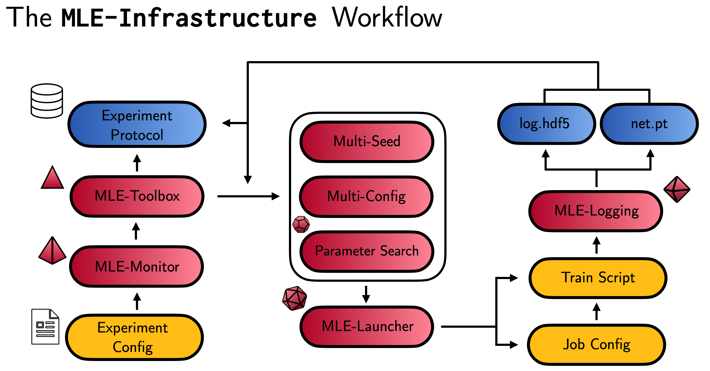

# Welcome to the MLE-Infrastructure 🔬

The MLE-Infrastructure provides a reproducible workflow for distributed Machine Learning experimentation (MLE) with minimal engineering overhead. It consists of 5 core packages:

- [`mle-logging`](https://github.com/mle-infrastructure/mle-logging): Experiment logging with easy multi-seed and configuration aggregation.
- [`mle-hyperopt`](https://github.com/mle-infrastructure/mle-hyperopt): Hyperparameter Optimization with config export, refinement & reloading.
- [`mle-monitor`](https://github.com/mle-infrastructure/mle-monitor): *TBC*
- [`mle-launcher`](https://github.com/mle-infrastructure/mle-launcher): *TBC*
- [`mle-toolbox`](https://github.com/mle-infrastructure/mle-toolbox): *TBC*

